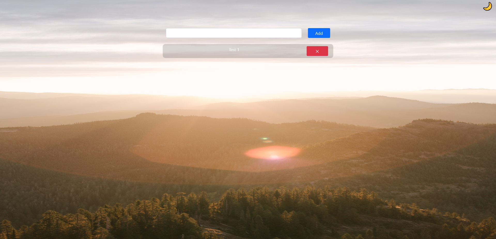
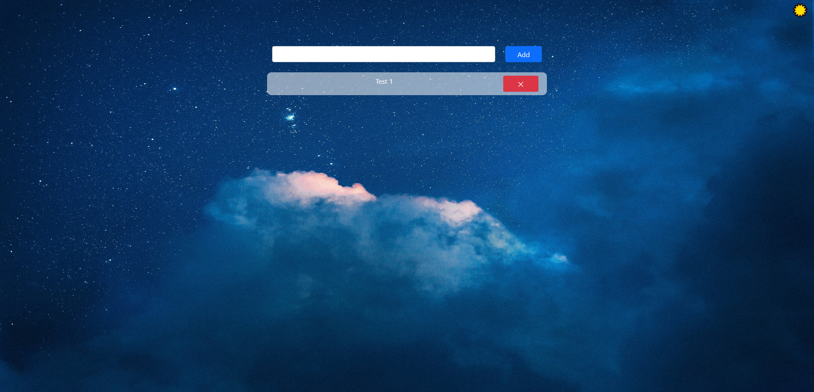

# Objective

Allow user to create a todo list.

## Run Application
- npm start
- yarn start

## Technologies

**Languages**
- JavaScript
- CSS
- HTML

**Framework/Libraries**
- React
- React-bootstrap
- Express
- Mongoose

**Database**
- MongoDB

## Features

- Dark and Light mode by click of button (&#9728; / &#x1F319;)
    - Change in background image by mode.
- Remove button to remove item from list.

## Screenshots

[background image](https://www.pexels.com/photo/mountains-and-trees-during-sunrise-4448846/)

[background image](https://www.pexels.com/photo/blue-and-white-sky-with-stars-4737484/)